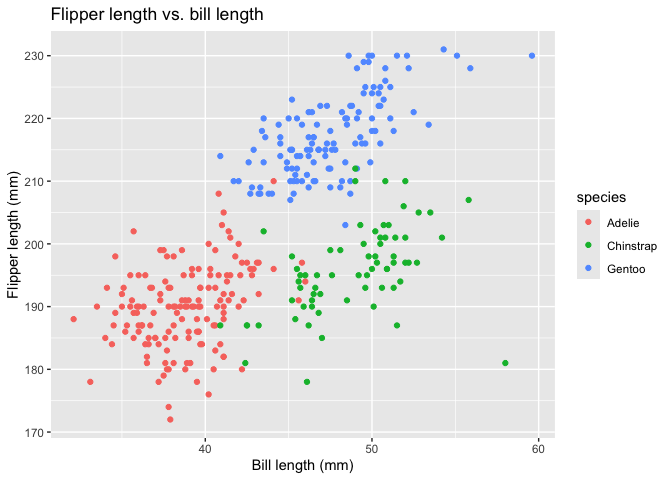

Data Science 1 Homework 1
================
Samina Rashiq
2024-09-21

# Problem 1

#### Load penguins dataset

``` r
data("penguins", package = "palmerpenguins")
```

#### Describe penguins dataset

``` markdown
The`penguins` dataset contains information about many types of penguins including the variables:
- `species`: species of penguin (Adelie, Chinstrap,or Gentoo)
- `island`: island where penguing was observed (Biscoe, Dream, or Torgersen)
- `bill_length_mm` : length of penguin's bill in mm (mean = 43.9219298)
- `bill_depth_mm`: depth of penguin's bill in mm (mean = 17.1511696)
- `flipper_length_mm`:length of penguin's flipper in mm (mean = 17.1511696). 
- `body_mass_g`: body mass of penguin in g (mean = 4201.754386)
- `sex`: The sex of the penguin in (male or female)
- `year`: The year data was collected.

The `penguins` dataset contains 344 rows and 8 columns. The mean flipper length is 200.9152047 mm. 
```

#### Make a scatterplot of flipper length vs. bill length

<!-- -->

# Problem 2

#### Create data frame

``` r
set.seed(420)

problem2_df = tibble(
  norm_samp = rnorm(10, mean = 0, sd = 1),
  vec_logical = norm_samp > 0,
  vec_char = sample(state.name, 10, replace = TRUE),
  vec_factor = factor(
    sample(
      c("lvl1", "lvl2", "lvl3"), 10, replace = TRUE))
)

print(problem2_df)
```

    ## # A tibble: 10 × 4
    ##    norm_samp vec_logical vec_char       vec_factor
    ##        <dbl> <lgl>       <chr>          <fct>     
    ##  1     0.268 TRUE        New York       lvl2      
    ##  2    -0.937 FALSE       Maryland       lvl1      
    ##  3     0.596 TRUE        Connecticut    lvl2      
    ##  4    -0.312 FALSE       New Jersey     lvl2      
    ##  5     0.398 TRUE        Rhode Island   lvl2      
    ##  6    -0.515 FALSE       Nevada         lvl2      
    ##  7    -0.552 FALSE       Nevada         lvl2      
    ##  8    -0.461 FALSE       North Dakota   lvl3      
    ##  9    -2.95  FALSE       Vermont        lvl2      
    ## 10    -0.767 FALSE       South Carolina lvl2

#### Calculate the mean of each variable

``` r
mean(pull(problem2_df, norm_samp))
```

    ## [1] -0.5229955

``` r
mean(pull(problem2_df, vec_logical))  
```

    ## [1] 0.3

``` r
mean(pull(problem2_df, vec_char)) 
```

    ## Warning in mean.default(pull(problem2_df, vec_char)): argument is not numeric
    ## or logical: returning NA

    ## [1] NA

``` r
mean(pull(problem2_df, vec_factor))
```

    ## Warning in mean.default(pull(problem2_df, vec_factor)): argument is not numeric
    ## or logical: returning NA

    ## [1] NA

#### Convert logical, character, and factor variables to numeric variables

``` r
num_logical <- as.numeric(pull(problem2_df, vec_logical))

num_char <- as.numeric(pull(problem2_df, vec_char))
```

    ## Warning: NAs introduced by coercion

``` r
num_factor <- as.numeric(pull(problem2_df, vec_factor))
```

R treats logical values as TRUE = 1 and FALSE = 0, which is why a mean
could be calculated before conversion.

R can’t change character variables into numeric values because they are
not binary or ordinal. This is why a mean could not be calculated and
conversion results in error.

Factor variable could not have mean calculated initially because integer
codes were not assigned. The conversion did that, allowing the
calculation to occur.
